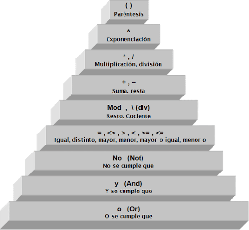
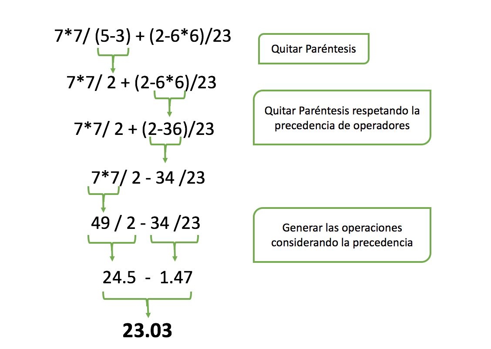

# **Curso Básico de Java SE (Handbook)**

## **Introducción a Java**

### **Que es Java?**
* **Simple**

  * Basado en C, la sitaxis es muy parecida a C y C++(OOP)
  * Se hereda de una sola clase
  * Clase String, que no existe en C ni en C++
  * Garbage Colector, se encarga de remover los objetos que no
estan en uso para liberarlos de la memoria para hacer mas
eficiente el lenguaje

* **Orientado a Objetos**

  * Es un paradigma, tiene su teoria, filosofia. Muy importante
aprenderla como tal.
  * Java como tal es Lenguaje Oriendato a Objetos.

* **Distribuido**

  * Diseñado para trabajar con protocolos TCP/IP, HTTP, FTP, etc.
  * Todo lo necesario para trabajar en ambientes de redes.


* **Multihilo**

  * Tenemos mayor procesamiento en las computadoras o telefonos.
Un Ejemplo, la clase Thread para trabajar con procesos que
ocurren al mismo tiempo al paralelo, dos o mas procesos.

* **Arquitectura Neutral**

  * Corre no solo en un ambiente de trabajo(no solo Windows o
Linux)

* **Portable**

  * Corre en varios sistemas operativos.

* **Alto desempeño**

  * Es Compilado e Interpretado que lo hace tener un alto
desempeño

* **Seguro**

  * Gracias a la Maquina Virtual (JVM)
  * El codigo no esta expuesto a nadie ya que a la hora de compilar
el codigo lo convierte a ByteCode(archivo .class) y a la hora de
correr el programa no lee el codigo fuente.


### **Orígenes de Java**

* Nació en 1991.
* Su creador es James Gosling.
* Fué adquirido por Sun Microsystems.
* Surge por la necesidad de comunicación de dispositivos, era necesario que estos tuvieran un software portable.
* En el 2009, Fué adquirido por Oracle.
* Existe las Categorias
* Java SE(Standart Edition):Es la base de Java.
* Java EE(Enterprise Edition):Usado en ambientes 
Empresariales(Web).
* Java ME(Micro Edition):usada para dispositivos móviles(Ya no 
se utiliza).
* Actualmente no se usa para la interfaz Web


### **Cómo funciona la máquina virtual de java**


### Método main

El método main en java es un estándar utilizado por la JVM para iniciar la ejecución de cualquier programa Java. Dicho método se conoce como punto de entrada de la aplicación java, pero no en el caso de contenedores gestionados por ambientes como Servlets, EJB o MIDlet ellos tienen métodos de ciclo de vida propios.

## **Tipos de datos**

### Tipos de datos primitivos en Java

En Java existen ocho tipos de datos primitivos que se pueden clasificar en:

* Números enteros (byte, short, int, long).
* Números reales (float, double).
* Carácter (char).
* Booleano o lógico (boolean).

_De todos ellos, salvo del tipo boolean que únicamente puede ser true o false_

En la siguiente tabla se muestran sus posibles valores mínimo y máximo:

**Lista de tipos de datos primitivos del lenguaje Java**

Tipo | Tamaño | Valor mínimo | Valor máximo
:--: | :----: | -----------: | ------------
byte | 8 bits | -128 | 127
short | 16 bits | -32768 | 32767
int | 32 bits | -2147483648 | 2147483647
long | 64 bits | -9223372036854775808 | 9223372036854775807
float | 32 bits | -3.402823e38 | 3.402823e38
double | 64 bits | -1.79769313486232e308 | 1.79769313486232e308
char | 16 bits | ‘\u0000’ | ‘\uffff’

_**Nota:** un dato de tipo carácter se puede escribir entre comillas simples, por ejemplo ‘a’, o también indicando su valor Unicode, por ejemplo ‘\u0061’._


### Tipos de datos con punto decimal

* **Float:** Se puede utilizar para casos como notas de colegio o escuela ( Ejemplo 4.5), para pesos de algunos artículos o productos de ventas en almacén, precios de los productos o servicios.
* **Double:** Es utilizado para todo las demás transacciones que tiene que ser más precisas en los resultados y cualquier valor puede alterar el resultado.

### Naming en Java

* Java es sensible a las mayúsculas, _"variable"_ y _"Variable"_ son dos nombres de variables diferentes. 
* Las constantes se escriben en mayúsculas, y, si tienen dos palabras, se separan con un ***"_"***.
* La convención que se debe utilizar en Java es ***Camel Case***, la cual tiene dos formas: 
  * **Upper Camel Case** y 
  * **Lower Camel Case**. 

    El nombre de las clases será con ***Upper*** (por ejemplo: HolaMundo). 

    El nombre de las variables, los objetos y los métodos será con ***Lower*** (por ejemplo: minValor).

### Cast de variables 

El casteo (***casting***) es un procedimiento para transformar una variable primitiva de un tipo a otro, o transformar un objeto de una clase a otra clase siempre y cuando haya una relación de herencia entre ambas.

Existen distintos tipos de casteo (casting) de acuerdo a si se utilizan tipos de datos o clases.

#### **Casteo Implícito (Widening Casting)**

El casteo implícito radica en que no se necesita escribir código para que se lleve a cabo. Ocurre cuando se realiza una conversión ancha – ***widening casting*** – es decir, cuando se coloca un valor pequeño en un contenedor grande.

***Ejemplo:***

``` Java
// Define una variable de tipo int con el valor 100
int numeroEntero = 100; 
// Define una variable de tipo long a partir de un int
long numeroLargo = numeroEntero
```

#### **Casteo Explicito (Narrowing Casting)**

El casteo explicito se produce cando se realiza una conversión estrecha – ***narrowing casting*** – es decir, cuando se coloca un valor grande en un contenedor pequeño. Son susceptibles de perdida de datos y deben realizarse a través de código fuente, de forma explicita.

***Ejemplo:***
``` Java
// Define una variable del tipo int con el valor 250
int numeroEntero = 250;
// Define una variable del tipo short y castea la variable numeroEntero
short s = (short) numeroEntero;
```

### **Arrays**

En java tenemos diferentes tipos de arrays que podremos emplear entre los cuales encontramos los siguientes:

**ArrayList:** Un arrayList es una estructura de almacenamiento dinámico, implementada por java, esta tiene la semejanza a una lista ligada , y como tal tiene la capacidad de crecer o decrecer en tiempo de ejecución.

**LinkedList:** Usa internamente una lista doblemente ligada,

**HashMap:** Básicamente designa claves únicaspara los valores correspondientes que se pueden recuperar en cualquier punto dado.

#### **Se pueden declarar:**

* Se definen usando corchetes después del tipo

``` Java
// <tipo>[] <nombre>;
int[] arreglo;

// <tipo> <nombre>[];
int arreglo[];
```

* Si queremos darle un valor, debemos hacer usando las llaves

``` Java
// <tipo>[] <nombre> = { valor_1, valor_2 };
int[] arreglo = { 1, 2, 3 };
```

* También podemos optar por definir su tamaño 

``` Java
// <tipo>[] <nombre> = new <tipo>[<tamaño>];
int[] arreglo = new int[3];
```

* Se puede verificar las variables en el arreglo 

``` Java
// <tipo>[] <nombre> = new <tipo>[<tamaño>]{ valor_1, valor_2, valor_3};
int[] arreglo = new int[3]{ 1, 2, 3};
```

## Operadores en Java

### Tipos de operadores 

#### **Operadores aritméticos**

Se usan para realizar operaciones de la matemática básica como la suma, resta, multiplicación, división.

Operador | Símbolo | Acción
-------- | :-----: | ------
Suma | + | Suma dos operandos
Resta | - | Resta el segundo operando del primero
Multiplicación | * | Multiplica los dos operandos
División | / | Divide el primer operando por el segundo
Resto (módulo) | % | Facilita el resto de la división entre dos operandos (residuo de la división)

#### **Operadores de Relacionales**

Los operadores relacionales se usan para evaluar expresiones condicionales y se basan en el concepto de verdadero o falso

Operador | Símbolo | Ejemplo
-------- | :-----: | -------
Mayor que | > | 3 > 4 FALSO; 8 > 5 VERDADERO
Mayor o igual que | >= | 3 >= 3 VERDADERO; 4 >= 4 FALSO
Menor que | < | 4 < 6 VERDADERO; 7 < 4 FALSO
Menor o igual que | <= | 2 <= 2 VERDADERO; 3 <= 2 FALSO
Igual | == | 4 = 4 VERDADERO; 3 = 4 FALSO
Distinto | != | 6 != 7 VERDADERO; 7 != 7 FALSO

#### **Operadores Lógicos**

Los operadores lógicos son usados para concatenar dos o más expresiones con operadores relacionales.

Operador | Símbolo | Ejemplo
-------- | :-----: | -------
AND | && | AND lógico
OR | \|\| | OR lógico
NOT | ! | Negación

### **Precedencia de operadores**

Es muy probable que en alguna parte hayas visto operaciones como estas: 77/ (5-3) + (2-66)/23 de las cuales no has sabido ni por dónde empezar para resolverlas.

Java tiene un mecanismo llamado Precedencia de Operadores que permite Jerarquizar las operaciones dándoles una prioridad con respecto a otra, a continuación te muestro una tabla dónde el punto más alto es la prioridad más alta.



Ahora tomando como punto de partida la imagen anterior, podríamos resolver la operación haciendo los siguientes pasos:


## **Control de flujo**

### **if/else, switch**

#### La sentencia if/else

La sentencia if/else nos permite ejecutar un bloque de código o no, dependiendo de una condición que se evalúa justo antes de este bloque.
Esta condición se evalúa a un valor booleano, es decir, su resultado solo puede tomar dos valores, true o false.

#### La sentencia switch

Esta sentencia permite elegir múltiples caminos a seguir por el flujo de ejecución de nuestro programa.
En este caso, el camino a seguir se selecciona basándose en el valor de una expresión que se evalúa a un valor entero

### Ciclo while/do while

#### While

Los ciclos while son también una estructura cíclica, que nos permite ejecutar una o varias líneas de código de manera repetitiva sin necesidad de tener un valor inicial e incluso a veces sin siquiera conocer cuando se va a dar el valor final que esperamos, los ciclos while, no dependen directamente de valores numéricos, sino de valores booleanos, es decir su ejecución depende del valor de verdad de una condición dada, verdadera o falso, nada más. De este modo los ciclos while, son mucho más efectivos para condiciones indeterminadas, que no conocemos cuando se van a dar a diferencia de los ciclos for, con los cuales se debe tener claro un principio, un final y un tamaño de paso.

** Estructura **

``` Java
while(true){
	// Instrucciones
}
```

#### Do while

Los ciclos do-while son una estructura de control cíclica, los cuales nos permiten ejecutar una o varias líneas de código de forma repetitiva sin necesidad de tener un valor inicial e incluso a veces sin siquiera conocer cuando se va a dar el valor final, hasta aquí son similares a los ciclos while, sin embargo el ciclo do-while nos permite añadir cierta ventaja adicional y esta consiste que nos da la posibilidad de ejecutar primero el bloque de instrucciones antes de evaluar la condición necesaria, de este modo los ciclos do-while, son más efectivos para algunas situaciones especificas. En resumen un ciclo do-while, es una estructura de control cíclica que permite ejecutar de manera repetitiva un bloque de instrucciones sin evaluar de forma inmediata una condición especifica, sino evaluándola justo después de ejecutar por primera vez el bloque de instrucciones

** Estructura **

``` Java
do {
	// Instrucciones
} while(condicion);
```

### Ciclo for y foreach

#### for 

Los ciclos for (o ciclos para) son una estructuras de control cíclica, nos permiten ejecutar una o varias líneas de código de forma iterativa (o repetitiva), pero teniendo cierto control y conocimiento sobre las iteraciones. En el ciclo for, es necesario tener un valor inicial y un valor final, y opcionalmente podemos hacer uso del tamaño del "paso" entre cada "giro" o iteración del ciclo.

** Estructura **

``` Java
for(int i = 0; i <= N; i++) {
	// Instrucciones
}
```

#### foreach

Esta estructura nos permite recorrer una Colección o un array de elementos de una forma sencilla. Evitando el uso de Iteradores o de un bucle for normal.

** Estructura **

``` Java
for (int elemento : elementos) {
	// Instrucciones
}
```