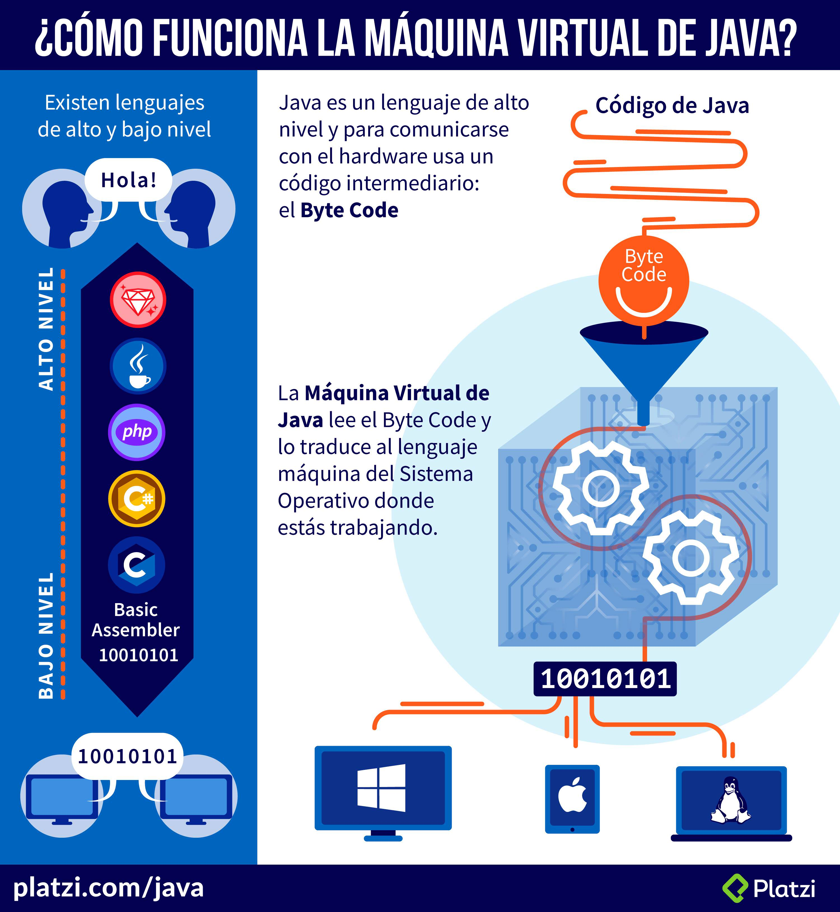

# **Curso Básico de Java SE (Handbook)**

## **Introducción a Java**

### **Que es Java?**
* **Simple**

  * Basado en C, la sitaxis es muy parecida a C y C++(OOP)
  * Se hereda de una sola clase
  * Clase String, que no existe en C ni en C++
  * Garbage Colector, se encarga de remover los objetos que no
estan en uso para liberarlos de la memoria para hacer mas
eficiente el lenguaje

* **Orientado a Objetos**

  * Es un paradigma, tiene su teoria, filosofia. Muy importante
aprenderla como tal.
  * Java como tal es Lenguaje Oriendato a Objetos.

* **Distribuido**

  * Diseñado para trabajar con protocolos TCP/IP, HTTP, FTP, etc.
  * Todo lo necesario para trabajar en ambientes de redes.

* **Multihilo**

  * Tenemos mayor procesamiento en las computadoras o telefonos.
Un Ejemplo, la clase Thread para trabajar con procesos que
ocurren al mismo tiempo al paralelo, dos o mas procesos.

* **Arquitectura Neutral**

  * Corre no solo en un ambiente de trabajo(no solo Windows o
Linux)

* **Portable**

  * Corre en varios sistemas operativos.

* **Alto desempeño**

  * Es Compilado e Interpretado que lo hace tener un alto
desempeño

* **Seguro**

  * Gracias a la Maquina Virtual (JVM)
  * El codigo no esta expuesto a nadie ya que a la hora de compilar
el codigo lo convierte a ByteCode(archivo .class) y a la hora de
correr el programa no lee el codigo fuente.

### **Orígenes de Java**

* Nació en 1991.
* Su creador es James Gosling.
* Fué adquirido por Sun Microsystems.
* Surge por la necesidad de comunicación de dispositivos, era necesario que estos tuvieran un software portable.
* En el 2009, Fué adquirido por Oracle.
* Existe las Categorias
* Java SE(Standart Edition):Es la base de Java.
* Java EE(Enterprise Edition):Usado en ambientes 
Empresariales(Web).
* Java ME(Micro Edition):usada para dispositivos móviles(Ya no 
se utiliza).
* Actualmente no se usa para la interfaz Web

### **Cómo funciona la máquina virtual de java**

### Método main

El método main en java es un estándar utilizado por la JVM para iniciar la ejecución de cualquier programa Java. Dicho método se conoce como punto de entrada de la aplicación java, pero no en el caso de contenedores gestionados por ambientes como Servlets, EJB o MIDlet ellos tienen métodos de ciclo de vida propios.

## **Tipos de datos**

### Tipos de datos primitivos en Java

En Java existen ocho tipos de datos primitivos que se pueden clasificar en:

* Números enteros (byte, short, int, long).
* Números reales (float, double).
* Carácter (char).
* Booleano o lógico (boolean).

_De todos ellos, salvo del tipo boolean que únicamente puede ser true o false_

En la siguiente tabla se muestran sus posibles valores mínimo y máximo:

**Lista de tipos de datos primitivos del lenguaje Java**

Tipo | Tamaño | Valor mínimo | Valor máximo
:--: | :----: | -----------: | ------------
byte | 8 bits | -128 | 127
short | 16 bits | -32768 | 32767
int | 32 bits | -2147483648 | 2147483647
long | 64 bits | -9223372036854775808 | 9223372036854775807
float | 32 bits | -3.402823e38 | 3.402823e38
double | 64 bits | -1.79769313486232e308 | 1.79769313486232e308
char | 16 bits | ‘\u0000’ | ‘\uffff’

_**Nota:** un dato de tipo carácter se puede escribir entre comillas simples, por ejemplo ‘a’, o también indicando su valor Unicode, por ejemplo ‘\u0061’._

### Tipos de datos con punto decimal

* **Float:** Se puede utilizar para casos como notas de colegio o escuela ( Ejemplo 4.5), para pesos de algunos artículos o productos de ventas en almacén, precios de los productos o servicios.
* **Double:** Es utilizado para todo las demás transacciones que tiene que ser más precisas en los resultados y cualquier valor puede alterar el resultado.

### Naming en Java

* Java es sensible a las mayúsculas, _"variable"_ y _"Variable"_ son dos nombres de variables diferentes. 
* Las constantes se escriben en mayúsculas, y, si tienen dos palabras, se separan con un ***"_"***.
* La convención que se debe utilizar en Java es ***Camel Case***, la cual tiene dos formas: 
  * **Upper Camel Case** y 
  * **Lower Camel Case**. 

    El nombre de las clases será con ***Upper*** (por ejemplo: HolaMundo). 

    El nombre de las variables, los objetos y los métodos será con ***Lower*** (por ejemplo: minValor).
